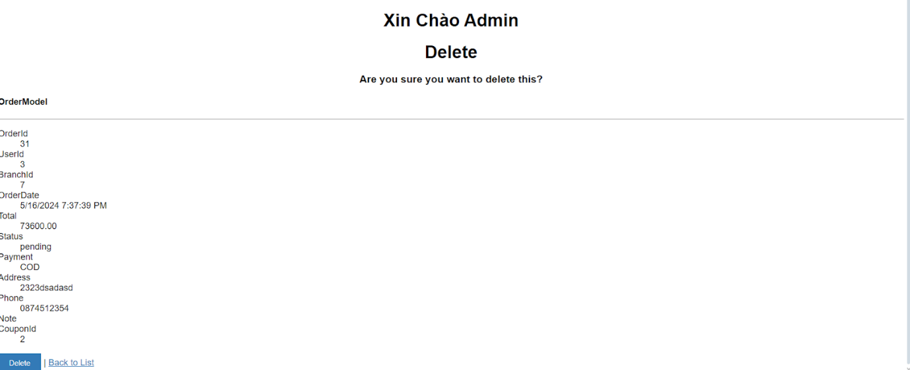

# PHẦN 1: GIỚI THIỆU

Đồ án này nhằm xây dựng một hệ thống website bán thức ăn nhanh, bao gồm một trang web dành cho khách hàng và một trang web dành cho admin. Trang web dành cho khách hàng sẽ cung cấp các tính năng chính như xem menu món ăn, đặt hàng, thanh toán, theo dõi đơn hàng và xem vị trí các chi nhánh. Trang dành cho admin sẽ cung cấp các tính năng quản lý món ăn, quản lý đơn hàng, quản lý mã giảm giá, quản lý chi nhánh, quản lý tài khoản, quản lý truy cập phân quyền và thống kê doanh thu.

Một số tính năng trong web admin sẽ sử dụng một web API để cung cấp dữ liệu và xử lý các chức năng thêm sửa xóa.

Mục tiêu của đồ án là xây dựng một hệ thống hoàn chỉnh và ổn định để cung cấp dịch vụ bán thức ăn nhanh cho người dùng. Đồ án cũng sẽ tập trung vào việc tối ưu hóa trải nghiệm người dùng trên cả hai trang web, đảm bảo tính thân thiện và dễ sử dụng.

Cuối cùng, đồ án sẽ tập trung vào việc tạo ra một giao diện quản trị thân thiện và dễ sử dụng cho admin, giúp người quản trị có thể quản lý hệ thống một cách hiệu quả và thuận tiện.

- Cấu trúc database

- Giao diện của trang web khách hàng được kế thừa từ [Codex](https://htmlcodex.com/vegetable-website-template/).
- Dữ liệu các món ăn và hình ảnh được lấy từ [Popeyes Viet Nam](https://popeyes.vn/)

### **PHÂN CÔNG CÔNG VIỆC**

Trần Ngọc Thành:
- Toàn bộ trang web khách hàng.
- Tạo API và giao diện sử dụng API của chức năng quản lý món ăn và quản lý mã giảm giá trên web admin.
- Chức năng quản lý khách hàng.
- Chức năng thống kê doanh thu theo tháng.

Lâm Quốc Huy:

- Tạo API và giao diện sử dụng API của chức năng quản lý đơn hàng và quản lý chi nhánh trên web admin.
- Tạo API và giao diện sử dụng API của chức năng quản lý món ăn và quản lý mã giảm giá trên web admin.
- Chức năng đăng nhập và phân quyền của web admin.

# PHẦN 2: CHỨC NĂNG

## 2.1 Trang Khách Hàng

### 2.1.1 Layout Khách Hàng

Bao giờ Header cũng có một thanh như sau

Bao gồm:

Logo Popeyes: ấn vào sẽ quay về trang Home.

Mục Trang chủ: ấn vào cũng quay về trang Home.

Thực đơn: đi vào trang thực đơn.

Đăng ký: đi vào trang đăng ký tài khoản khách hàng.

Cửa hàng: danh sách các chi nhánh và vị trí trên bản đồ.

Icon giỏ hàng: khi thêm món ăn vào giỏ hàng thì trên giỏ hàng sẽ hiển thị số lượng vật phẩm trong giỏ.

Icon khách hàng: khi chưa đăng nhập ấn vào sẽ vào trang đăng nhập, khi đã đăng nhập ấn vào sẽ vào trang thông tin khách hàng.

Sau khi đăng nhập thì sẽ có thêm 2 icon:

Đăng xuất: đăng xuất khỏi tài khoản.

Icon lịch sử: thể hiện lịch sử mua hàng

Footer:

### 2.1.2 Trang Home

Ban đầu nếu truy cập vào trang web ví dụ fastfood.com thì sẽ vào giao diện trang Home:

Trang Home các có các hình ảnh quảng cáo và 3 nút: Đăng Ký, Đăng Nhập, Đặt Món

Đăng ký: đi vào trang đăng ký tài khoản khách hàng.

Đặt Món: đi vào trang thực đơn.

Đăng Nhập: đi vào trang đăng nhập.

### 2.1.3 Trang Đăng Ký(/KhachHang/DangKy)

Khách hàng có thể đăng ký tài khoản mới bất kỳ lúc nào.

Khách cần nhập đầy đủ thông tin cũng như nhập đúng định dạng dữ liệu ở mỗi ô cần nhập.

Ví dụ: Tại phần nhập email khách hàng cần nhập đúng như

Tại phần số điện thoại cần nhập đúng định dạng số điện thoại tại Việt Nam.

Sau khi ấn đăng ký nếu khách hàng chưa nhập ô nào hoặc chưa đúng định dạng thì trang web sẽ báo đỏ ở ô đó kèm tên lỗi.

Khi đăng ký thành công sẽ chuyển sang trang đăng nhập.

### 2.1.4 Trang Đăng Nhập(/KhachHang/DangNhap)

Chỉ vào được khi chưa đăng nhập.

Có các ô để khách hàng nhập tên đăng nhập và mật khẩu.

Sau khi ấn nút đăng nhập, nếu nhập sai tên hoặc mật khẩu sẽ báo lỗi yêu cầu khách hàng nhập lại.

Bên dưới nút đăng nhập cũng có nút để vào trang đăng ký.

Đăng nhập thành công sẽ trở về trang Home.

Khi khách hàng ấn vào nút quên mật khẩu sẽ hiện một hộp thoại thông báo yêu cầu khách hàng gọi vào hotline để được hỗ trợ reset mật khẩu.

### 2.1.5 Trang Thực đơn(/DoAn)

Ở trung tâm của trang sẽ là danh sách các món ăn được sắp theo mặc định là theo loại món ăn.

Bên trên bên phải có một dropdownlist cho pháp khách hàng lựa chọn sắp xếp món ăn theo giá tăng dần hoặc giảm dần.

Bên phải có các mục loại món ăn, khách hàng có thể ấn vào để xem các món ăn của từng loại.

Bên trên mục loại món ăn có một thanh tìm kiếm để khách hàng có thể tìm món ăn theo tên.

Khi khách hàng muốn đặt món nào thì ấn vào mục thêm vào giỏ hàng, sẽ tự động chuyển sang trang giỏ hàng.

### 2.1.6 Trang Giỏ Hàng(/Cart/ListCart)

Hiển thị danh sách các món ăn mà khách hàng đã ấn đặt hàng cùng số lượng và  tổng tiền các món ăn đó.

Khách hàng có thể tùy chỉnh số lượng bằng cách ấn nút (+) hoặc (-) ở trên mục món ăn đó.

Mỗi mục món ăn sẽ có một nút (X) nằm bên phải ngoài cùng để xóa món ăn.

Bên dưới có một ô để nhập mã giảm giá, nếu mã giảm giá hợp lệ thì sẽ hiển thị số tiền được giảm hay ô Cart Total.

Sau khi chọn đủ món ăn cần đặt khách hàng có thể xác nhận tổng tiền cần thanh toán ở dưới và ấn đặt món.

Nếu chưa đăng nhập sẽ tự động chuyển về trang đăng nhập, sau khi đăng nhập xong cần ấn lại vào giỏ hàng để đặt món.

Nếu đã đăng nhập sẽ chuyển sang trang checkout.

### 2.1.7 Trang Thanh Toán(/Cart/Checkout)

Bên phải màn hình sẽ hiển thị danh sách các món ăn đã đặt.

Bên trái màn hình hiển thị các ô để nhập thông tin khách hàng sẽ được lưu trên hóa đơn(tên người nhận, địa chỉ địa nhận hàng, số điện thoại), mặc định là thông tin của khách khi đăng ký tài khoản, khách hàng có thể sửa các ô này và nhập ghi chú nếu muốn.

Khách hàng có thể tích vào ô cập nhật thông tin để tự động lưu thông tin đã sửa ở trên để tự động nhập cho lần đặt hàng sau.

Nếu khách hàng không chọn chi nhánh thì mặc định sẽ là đặt hàng ở chi nhánh có id bằng 1.

Phương thức thanh toán mặc định là thanh toán khi nhận hàng (COD).

Khách hàng có thể chuyển sang phương chuyển khoản (QR) bằng cách click vào nút quét mã QR bên dưới,lúc này sẽ hiện ra mã QR cho khách hàng quét kèm nội dung hàng cần nhập khi chuyển khoản, nội dung này sẽ được hệ thống tự tạo ra gồm <tên khách hàng> - <mã đơn hàng>.

Sau khi đặt hàng thành công:

### 2.1.8 Trang Thông Tin Khách Hàng(/KhachHang/Profile)

Khách có thể vào trang này thông qua biểu tượng thông tin ngay bên cạnh tên khách hàng

Hiển thị thông tin của khách hàng như lúc khách hàng đăng ký gồm:

Tên đăng nhập; Họ tên; Giới tính; Ngày sinh; Địa chỉ; Số diện thoại, Email.

Bên dưới có một nút để vào trang  lịch sử mua hàng.

### 2.1.9 Trang  Lịch Sử Mua Hàng(/KhachHang/LichSu)

Kháng hàng có thể ấn vào biểu tượng lịch sử để xem lịch sử đặt hàng.

Hiển thị danh sách các đơn hàng khách hàng đã mua bao gồm:

Mã đơn hàng; Chi nhánh đã đặt; Loại thanh toán; Tình trạng đơn hàng; Tổng tiền đơn hàng;

Mỗi đơn hàng có một nút “Xem thêm” để có thể xem chi tiết hóa đơn đó.

## 2.2 Trang API

Sẽ bao gồm các API thực hiện các công việc thêm, sửa, xóa và xuất dữ liệu theo các thuộc tính của các chức năng quản lý chi nhánh, quản lý đơn hàng, quản lý món ăn, quản lý mã giảm giá.

## 2.3 Trang Admin

Chỉ có tài khoản có role_id bằng 0 tức quyền admin mới có thể truy cập tất cả các chức năng trong trang admin.

Các tài khoản quản lý sẽ có role_id bằng với mã chi nhánh mà mình quản lý. Các tài khoản này chỉ có quyền truy cập vào chức năng thống kê và

- Giao diện đăng nhập.

- Sau khi đăng nhập thành công

- Giao diện đối với tài khoản admin

- Giao diện đối với tài khoản khác ( tài khoản của quản lý các chi nhánh)

### 2.3.1 Trang Quản Lý Tài Khoản Admin
- Giao diện khi vào trang

- Giao diện tạo tài khoản cho quản lý của các chi nhánh.

- Giao diện sửa tài khoản.

- Giao diện xác nhận xóa tài khoản.

### 2.3.2 Trang Quản Lý Chi Nhánh - Gọi API
- Giao diện khi vào trang

- Giao diện tạo chi nhánh mới.

- Giao diện sửa thông tin chi nhánh.

- Giao diện xác nhận xóa chi nhánh.

### 2.3.3 Trang Quản Lý Đơn Hàng - Gọi API

- Tài khoản admin được xem, sửa, xóa đơn hàng của tất cả chi nhánh.

- Các tài khoản khác có roles là id của chi nhánh nào thì chỉ được phép xem đơn hàng của chi nhánh mà mình quản lý. Ví dụ quản lý của chi nhánh 1:

- Giao diện xem chi tiết đơn hàng

- Giao diện chỉnh sửa đơn hàng (chủ yếu để chỉnh sửa tình trạng đơn hàng).

- Giao diện xác nhận hóa đơn hàng.

### 2.3.4 Trang Quản Lý Tài Khoản Khách Hàng(/Customer)
- Giao diện khi vào trang

Tại trang danh sách khách hàng, cả 2 nút tìm kiếm tài khoản khách hàng theo username và theo ID nếu tìm thấy đều vào thẳng trang Edit của tài khoản đó. Ấn nút Edit của từng khách hàng cụ thể cũng ra giao diện sửa thông tin tương tự.

- Chức năng này chủ yếu để reset mật khẩu của khách hàng.

- Tại trang danh sách khách hàng , sau khi ấn nút Create New Customer sẽ vào giao diện tạo tài khoản

- Tại trang danh sách khách hàng,sau khi ấn nút Delete của khách hàng nào sẽ ra giao diện xác nhận xóa tài khoản của khách hàng đó.

Tại bất kỳ giao diện nào của trang khách hàng , khi ấn vào “Back to List” sẽ quay về trang danh sách khách hàng

### 2.3.5 Trang Quản Lý Món Ăn(/Foods/ListFood) - Gọi API

- Chỉ có tài khoản admin đăng nhập mới vào được trang này.

- Khi nhập tên món ăn vào ô tìm kiếm (VD: bur) các hiển thị danh sách các món ăn có tên chứa từ khóa vừ nhập.

- Tại trang ListFood, sau khi nhập mã món ăn vào ô tìm kiếm theo ID  món ăn, nếu tồn tại món ăn thì sẽ vào giao diện Edit thông tin của món ăn đó. Ấn vào nút Edit của từng mục món ăn cũng ra được giao diện sửa thông tin tương tự.

- Tại trang ListFood, sau khi ấn nút Create New sẽ vào giao diện tạo mới món ăn.

- Tại trang ListFood, sau khi ấn nút Delete của món ăn nào sẽ vào giao diện xác nhận xóa món ăn đó.

Tại bất kỳ giao diện nào của trang món ăn, sau khi ấn “Back to List” sẽ quay về trang danh sách món ăn.

### 2.3.6 Trang Quản Lý Mã Giảm Giá(/Coupons/ListCoupon) - Gọi API

Chỉ có tài khoản admin đăng nhập mới vào được trang này.

- Những mã giảm giá nào đã hết hạn sử dụng hoặc chưa tới thời hạn sử dụng hoặc đã hết lượt sử dụng thì khách hàng sẽ không thể nhập và trên trang danh sách mã giảm giá sẽ hiển thị màu đỏ, những mã hợp lệ sẽ hiển thị màu xanh lá.

- Tại trang ListCoupon sau khi ấn Create New sẽ vào giao diện tạo mã giảm giá.

- Tại trang ListCoupon sau khi ấn vào nút Edit của mã giảm giá nào sẽ vào giao diện chỉnh sửa của mã giảm giá đó.

- Tại trang ListCoupon sau khi ấn vào nút Delete của mã giảm giá nào sẽ vào giao diện xác nhận xóa mã giảm giá đó.

Tại bất kỳ giao diện nào của trang mã giảm giá, sau khi ấn “Back to List” sẽ quay về trang danh sách mã giảm giá.

### 2.3.7 Trang Thống Kê(/Statistics)

Sau khi chọn tháng và năm sẽ hiện doanh thu theo tháng của các chi nhánh trong hệ thống.

- Chỉ những đơn hàng nào có trạng thái đã thanh toán (paid) thì mới được tính vào doanh thu.

# PHẦN 3: KẾT LUẬN

## 3.1 Về Trang Khách Hàng

Nhằm tối ưu hóa trải nghiệm khách hàng sau này sẽ có cập nhật những chức năng mới như:

Tìm món ăn theo khoảng giá.

Sau khi ấn thêm vào giỏ hàng sẽ ở giữ nguyên ở trang menu mà không nhảy thẳng vào giỏ hàng, đồng thời sẽ có một giỏ hàng mini ở bên cạnh để dễ theo dõi.

Mở rộng thêm các hình thức thanh toán như Card, Momo, QR PAY,..

Tự động hóa chức năng quên mật khẩu.

## 3.2 Về Trang API Và Trang Admin

Vì chưa hình dung được các chức năng quản lý tài khoản, đăng nhập phân quyền cũng như chức năng thống kê doanh thu khi tạo API sẽ như thế nào nên các chức năng này vẫn chưa có API. Nhằm giúp cho các nhà quản lý có thể kiểm soát website bán thức ăn nhanh tốt hơn, sau này đồ án sẽ hướng tới việc các chức năng trong web admin sẽ hoàn toàn sử dụng API để tăng cường tính bảo mật cũng như tăng hiệu suất và để dễ dàng bảo trì và phát triển.

